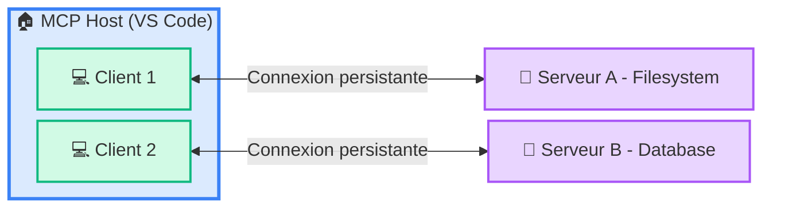

---
layout: default
section: "02"
sectionName: "Architecture"
slideName: "Client / Host / Server"
---

# Les trois acteurs

### 🏠 Host
**Unique composant d'interface**

* IDE / Interface de chat / Assistant de code...
* Accède à un LLM

### 💻 Client

**Interagit avec le serveur**

- 1 client par serveur
- Maintient la connexion
- 1 ou plusieurs clients par host

### 🔧 Serveur

**Fournit du contexte au client**

- Accède à des ressources externes (file system, bases de données, APIs...)

```mermaid
graph LR
    subgraph Host["🏠 MCP Host (VS Code)"]
    %%{init:{'flowchart':{'subGraphTitleMargin': {"top": 0,"bottom": 20},'nodeSpacing': 10, 'rankSpacing': 50}}}%%
        direction TB
        Client1["💻 Client 1"]
        Client2["💻 Client 2"]
    end

    subgraph Servers[" "]
        direction TB
        ServerA["🔧 Serveur A - Filesystem"]
        ServerB["🔧 Serveur B - Database"]
    end

    Client1 <-->|"Connexion persistante"| ServerA
    Client2 <-->|"Connexion persistante"| ServerB

    style Host fill:#dbeafe,stroke:#3b82f6,stroke-width:3px
    style Client1 fill:#d1fae5,stroke:#10b981,stroke-width:2px
    style Client2 fill:#d1fae5,stroke:#10b981,stroke-width:2px
    style Servers fill:none,stroke:none
    style ServerA fill:#e9d5ff,stroke:#a855f7,stroke-width:2px,padding:8px 20px
    style ServerB fill:#e9d5ff,stroke:#a855f7,stroke-width:2px,padding:8px 20px
```

