---
layout: default
section: "02"
sectionName: "Architecture"
slideName: "Schéma mental vs réalité"
---

# Ce qu'on imagine

```mermaid
%%{init: {'themeVariables': { 'edgeLabelBackground': 'white'}}}%%
graph LR
    User[👤 User] -->|1. Requête| Client[💻 Client]
    Client -->|2. Demande| LLM[🤖 LLM]
    LLM -->|3. Réponse| Tools[🔧 Tools]

    style User fill:#e1f5ff
    style Client fill:#fff4e6
    style LLM fill:#f3e5f5
    style Tools fill:#e8f5e9

    linkStyle 0 stroke:white,color:white
    linkStyle 1 stroke:white,color:white
    linkStyle 2 stroke:white,color:white
```

```mermaid
%%{init: {'themeVariables': { 'edgeLabelBackground': 'white'}}}%%
graph LR
    User[👤 User] -->|1. Requête| Client[💻 Client]
    Client -->|2. Demande| LLM[🤖 LLM]
    LLM -->|3. Réponse| Tools[🔧 Tools]

    style User fill:#e1f5ff
    style Client fill:#fff4e6
    style LLM fill:#f3e5f5
    style Tools fill:#e8f5e9

    linkStyle 1 stroke:white,color:white
    linkStyle 2 stroke:white,color:white
```

```mermaid
%%{init: {'themeVariables': { 'edgeLabelBackground': 'white'}}}%%
graph LR
    User[👤 User] -->|1. Requête| Client[💻 Client]
    Client -->|2. Demande| LLM[🤖 LLM]
    LLM -->|3. Réponse| Tools[🔧 Tools]

    style User fill:#e1f5ff
    style Client fill:#fff4e6
    style LLM fill:#f3e5f5
    style Tools fill:#e8f5e9

    linkStyle 2 stroke:white,color:white
```

```mermaid
%%{init: {'themeVariables': { 'edgeLabelBackground': 'white'}}}%%
graph LR
    User[👤 User] -->|1. Requête| Client[💻 Client]
    Client -->|2. Demande| LLM[🤖 LLM]
    LLM -->|3. Réponse| Tools[🔧 Tools]

    style User fill:#e1f5ff
    style Client fill:#fff4e6
    style LLM fill:#f3e5f5
    style Tools fill:#e8f5e9
```

---
layout: default
section: "02"
sectionName: "Architecture"
slideName: "La réalité"
---

# Ce qui se passe vraiment

```mermaid
%%{init: {'themeVariables': { 'edgeLabelBackground': 'white'}}}%%
graph LR
    User[👤 User] -->|1. Requête| Client[💻 Client]
    Client -->|2. Appel tool| Tool[🔧 Tool]
    Tool -->|3. Résultat| Client
    Client -->|4. Contexte| LLM[🤖 LLM]
    LLM -->|5. Réponse| Client
    Client -->|6. Autre tool| Tool

    style User fill:#e1f5ff
    style Client fill:#fff4e6
    style Tool fill:#e8f5e9
    style LLM fill:#f3e5f5

    linkStyle 0 stroke:white,color:white
    linkStyle 1 stroke:white,color:white
    linkStyle 2 stroke:white,color:white
    linkStyle 3 stroke:white,color:white
    linkStyle 4 stroke:white,color:white
    linkStyle 5 stroke:white,color:white
```

```mermaid
%%{init: {'themeVariables': { 'edgeLabelBackground': 'white'}}}%%
graph LR
    User[👤 User] -->|1. Requête| Client[💻 Client]
    Client -->|2. Appel tool| Tool[🔧 Tool]
    Tool -->|3. Résultat| Client
    Client -->|4. Contexte| LLM[🤖 LLM]
    LLM -->|5. Réponse| Client
    Client -->|6. Autre tool| Tool

    style User fill:#e1f5ff
    style Client fill:#fff4e6
    style Tool fill:#e8f5e9
    style LLM fill:#f3e5f5

    linkStyle 1 stroke:white,color:white
    linkStyle 2 stroke:white,color:white
    linkStyle 3 stroke:white,color:white
    linkStyle 4 stroke:white,color:white
    linkStyle 5 stroke:white,color:white
```

```mermaid
%%{init: {'themeVariables': { 'edgeLabelBackground': 'white'}}}%%
graph LR
    User[👤 User] -->|1. Requête| Client[💻 Client]
    Client -->|2. Appel tool| Tool[🔧 Tool]
    Tool -->|3. Résultat| Client
    Client -->|4. Contexte| LLM[🤖 LLM]
    LLM -->|5. Réponse| Client
    Client -->|6. Autre tool| Tool

    style User fill:#e1f5ff
    style Client fill:#fff4e6
    style Tool fill:#e8f5e9
    style LLM fill:#f3e5f5

    linkStyle 2 stroke:white,color:white
    linkStyle 3 stroke:white,color:white
    linkStyle 4 stroke:white,color:white
    linkStyle 5 stroke:white,color:white
```

```mermaid
%%{init: {'themeVariables': { 'edgeLabelBackground': 'white'}}}%%
graph LR
    User[👤 User] -->|1. Requête| Client[💻 Client]
    Client -->|2. Appel tool| Tool[🔧 Tool]
    Tool -->|3. Résultat| Client
    Client -->|4. Contexte| LLM[🤖 LLM]
    LLM -->|5. Réponse| Client
    Client -->|6. Autre tool| Tool

    style User fill:#e1f5ff
    style Client fill:#fff4e6
    style Tool fill:#e8f5e9
    style LLM fill:#f3e5f5

    linkStyle 3 stroke:white,color:white
    linkStyle 4 stroke:white,color:white
    linkStyle 5 stroke:white,color:white
```

```mermaid
%%{init: {'themeVariables': { 'edgeLabelBackground': 'white'}}}%%
graph LR
    User[👤 User] -->|1. Requête| Client[💻 Client]
    Client -->|2. Appel tool| Tool[🔧 Tool]
    Tool -->|3. Résultat| Client
    Client -->|4. Contexte| LLM[🤖 LLM]
    LLM -->|5. Réponse| Client
    Client -->|6. Autre tool| Tool

    style User fill:#e1f5ff
    style Client fill:#fff4e6
    style Tool fill:#e8f5e9
    style LLM fill:#f3e5f5

    linkStyle 4 stroke:white,color:white
    linkStyle 5 stroke:white,color:white
```

```mermaid
%%{init: {'themeVariables': { 'edgeLabelBackground': 'white'}}}%%
graph LR
    User[👤 User] -->|1. Requête| Client[💻 Client]
    Client -->|2. Appel tool| Tool[🔧 Tool]
    Tool -->|3. Résultat| Client
    Client -->|4. Contexte| LLM[🤖 LLM]
    LLM -->|5. Réponse| Client
    Client -->|6. Autre tool| Tool

    style User fill:#e1f5ff
    style Client fill:#fff4e6
    style Tool fill:#e8f5e9
    style LLM fill:#f3e5f5

    linkStyle 5 stroke:white,color:white
```

```mermaid
%%{init: {'themeVariables': { 'edgeLabelBackground': 'white'}}}%%
graph LR
    User[👤 User] -->|1. Requête| Client[💻 Client]
    Client -->|2. Appel tool| Tool[🔧 Tool]
    Tool -->|3. Résultat| Client
    Client -->|4. Contexte| LLM[🤖 LLM]
    LLM -->|5. Réponse| Client
    Client -->|6. Autre tool| Tool

    style User fill:#e1f5ff
    style Client fill:#fff4e6
    style Tool fill:#e8f5e9
    style LLM fill:#f3e5f5
```

---
layout: default
section: "02"
sectionName: "Architecture"
slideName: "Client / Host / Server"
---

# Les trois acteurs

### 🏠 Host
**Unique composant d'interface**

* IDE / Interface de chat / Assistant de code...
* Accède à un LLM

### 💻 Client

**Interagit avec le serveur**

- 1 client par serveur
- Maintient la connexion
- 1 ou plusieurs clients par host

### 🔧 Serveur

**Fournit du contexte au client**

- Accède à des ressources externes (file system, bases de données, APIs...)

**Exemple** : VS Code (Host) → instancie un Client → se connecte au Serveur filesystem

