---
layout: iframe

# the web page source
url: https://developers.events/#/2026/list?country=France
---
layout: default
section: "05"
sectionName: "Démo"
slideName: "Fausse idée"
---
layout: default
section: "05"
sectionName: "Démo"
slideName: "MCP Inspector"
hideFooter: true
---
<SlidevVideo controls>
  <source src="/public/videos/inspector.webm" type="video/webm">
</SlidevVideo>
---
layout: default
section: "05"
sectionName: "Démo"
slideName: "VS Code as Host"
hideFooter: true
---
<SlidevVideo controls>
  <source src="/public/videos/vscode.webm" type="video/webm">
</SlidevVideo>
---
layout: default
section: "05"
sectionName: "Démo"
slideName: "Fausse idée"
---

# Fausse idée

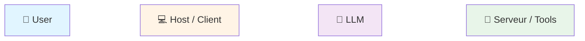

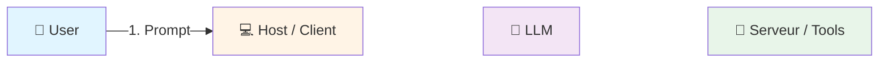

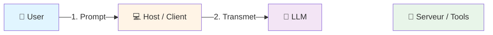

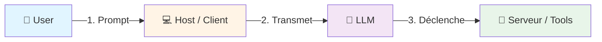

---
layout: default
section: "05"
sectionName: "Démo"
slideName: "La réalité"
---

# La réalité

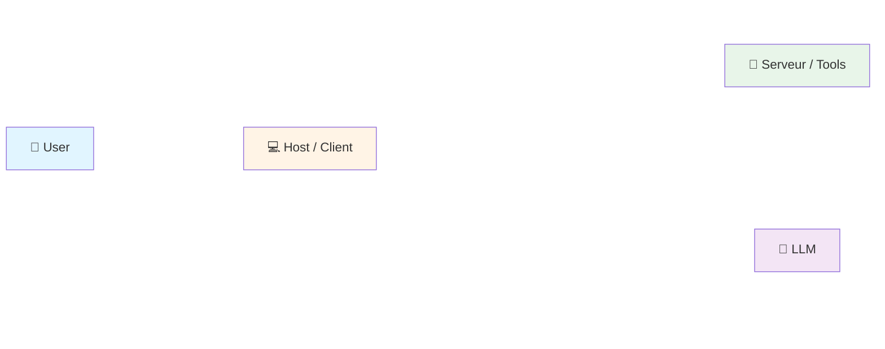

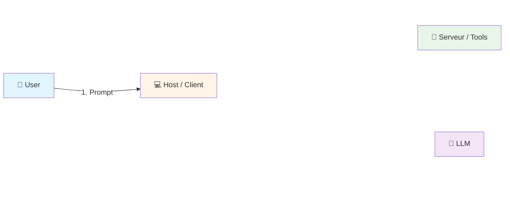

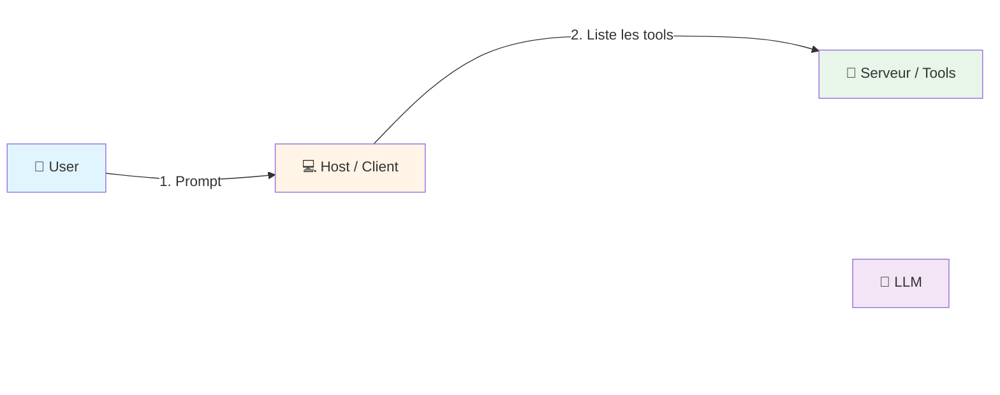

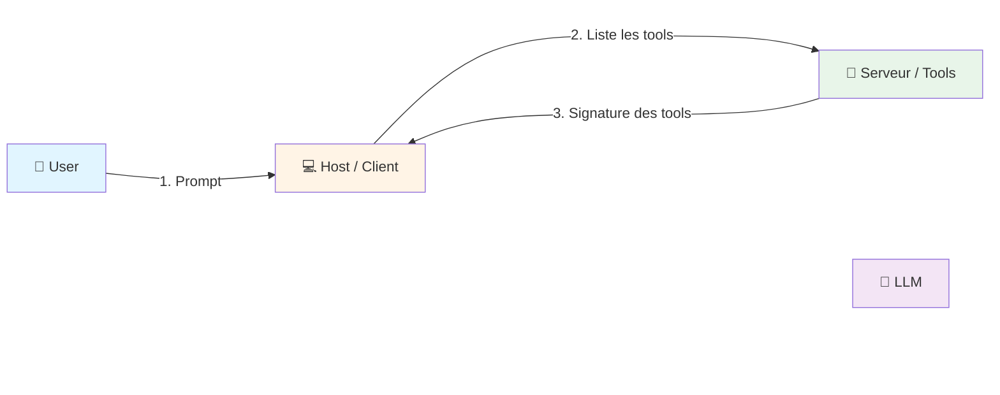

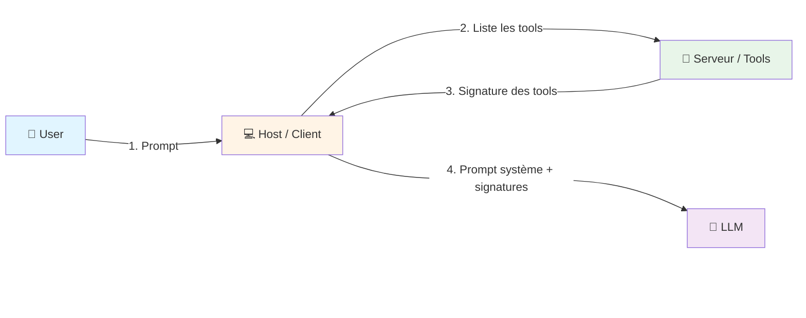

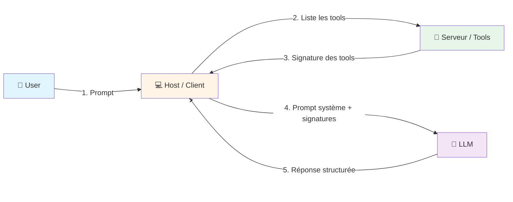

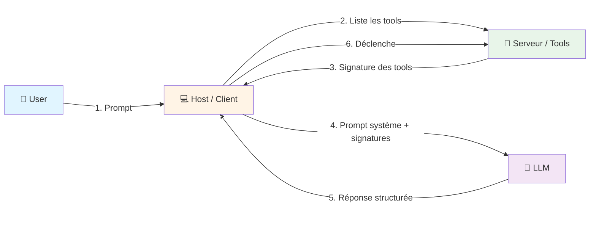

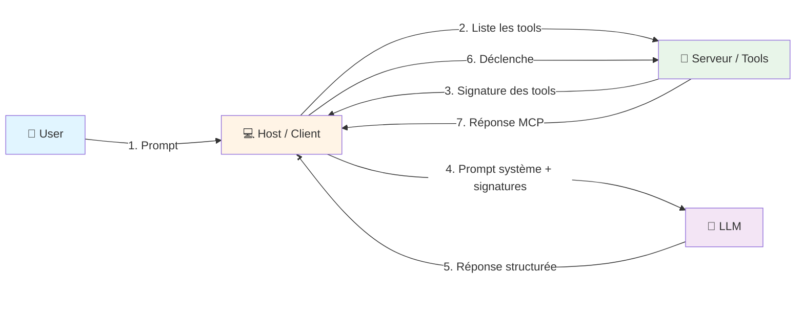

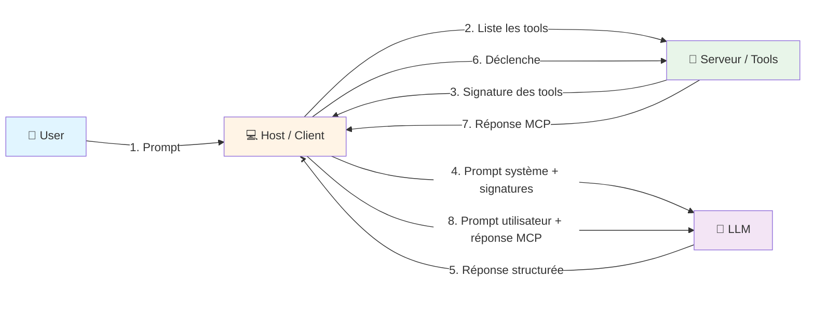

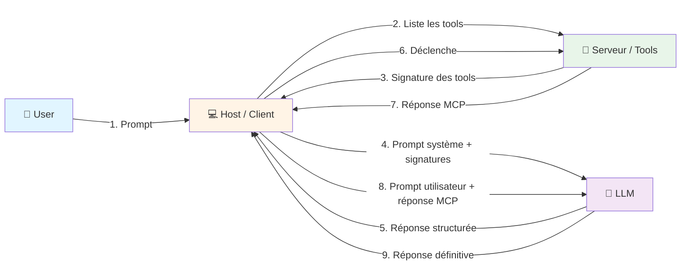

