---
layout: section-with-header
title: Sampling
subtitle: Le serveur demande au client d'utiliser son API d'inférence
section: "06"
sectionName: "Features client"
slideName: "Sampling"
---


---
layout: default
section: "06"
sectionName: "Features client"
slideName: "Sampling - Flux"
---

# Sampling - Flux d'exécution

<div style="position: relative; height: 400px; display: flex; align-items: center; justify-content: center;">

<div v-click.hide style="position: absolute; width: 100%; text-align: center;">

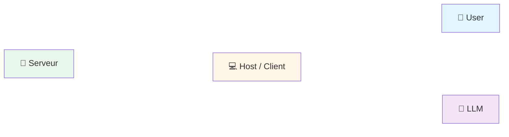

</div>

<div v-click="[1,2]" style="position: absolute; width: 100%; text-align: center;">

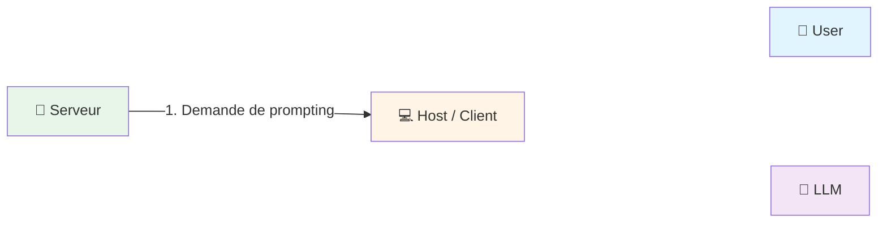

</div>

<div v-click="[2,3]" style="position: absolute; width: 100%; text-align: center;">

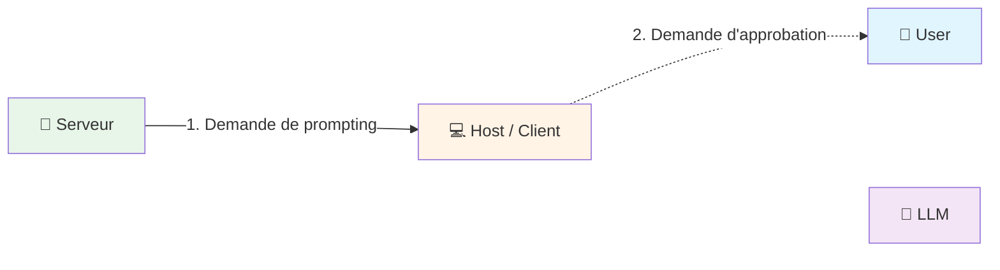

</div>

<div v-click="[3,4]" style="position: absolute; width: 100%; text-align: center;">

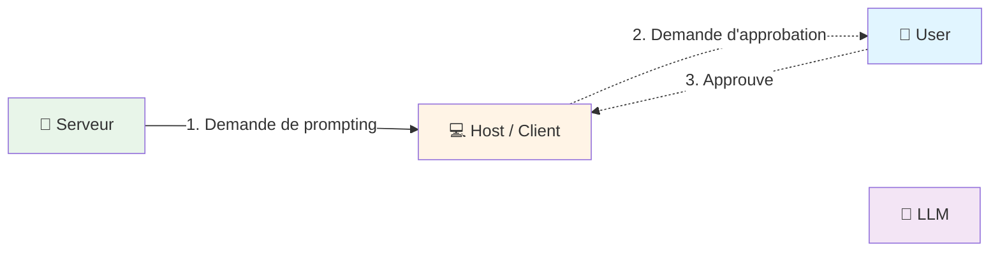

</div>

<div v-click="[4,5]" style="position: absolute; width: 100%; text-align: center;">

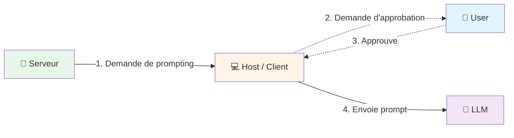

</div>

<div v-click="[5,6]" style="position: absolute; width: 100%; text-align: center;">

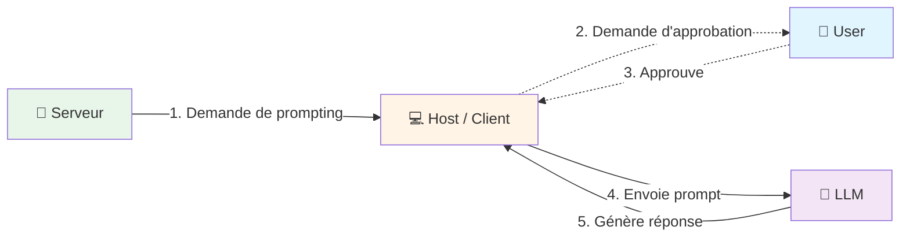

</div>

<div v-click=6 style="position: absolute; width: 100%; text-align: center;">

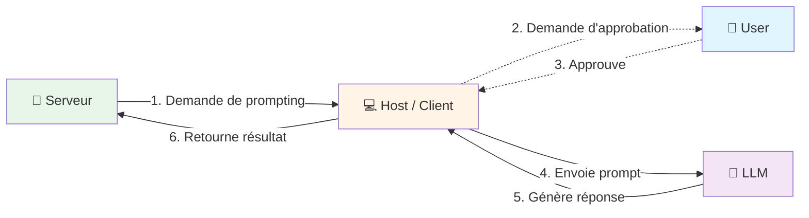

</div>

</div>


---
layout: default
section: "06"
sectionName: "Features client"
slideName: "Sampling - Requête"
---

# Sampling - Détails des payloads

Le serveur demande au client d'utiliser son LLM

<div class="grid grid-cols-2 gap-4">

<div>

```json {none|all}
{
  "method": "sampling/createMessage",
  "params": {
    "messages": [
      {
        "role": "user",
        "content": {
          "type": "text",
          "text": "Quelle est la meilleure conf ?"
        }
      }
    ],
    "maxTokens": 100
  }
}
```

<p class="text-sm italic">Requête (serveur → client)</p>

</div>

<div>

```json {none|all}
{
  "result": {
    "role": "assistant",
    "content": {
      "type": "text",
      "text": "Devoxx France bien sûr !!!"
    },
    "model": "claude-3-sonnet",
    "stopReason": "endTurn"
  }
}
```

<p class="text-sm italic">Réponse (client → serveur)</p>

</div>

</div>


---
layout: section-with-header
title: Elicitation
subtitle: Le serveur demande au client des informations à l'utilisateur
section: "06"
sectionName: "Features client"
slideName: "Elicitation"
---


---
layout: default
section: "06"
sectionName: "Features client"
slideName: "Elicitation - Flux"
---

# Elicitation - Flux d'exécution

<div style="position: relative; height: 400px; display: flex; align-items: center; justify-content: center;">

<div v-click.hide style="position: absolute; width: 100%; text-align: center;">

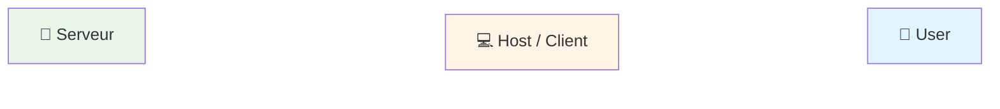

</div>

<div v-click="[1,2]" style="position: absolute; width: 100%; text-align: center;">

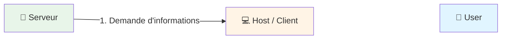

</div>

<div v-click="[2,3]" style="position: absolute; width: 100%; text-align: center;">

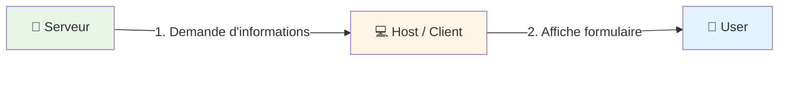

</div>

<div v-click="[3,4]" style="position: absolute; width: 100%; text-align: center;">

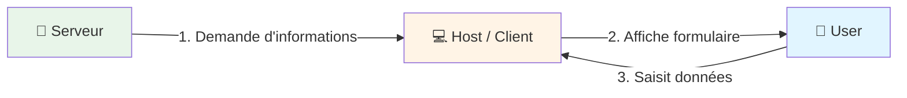

</div>

<div v-click=4 style="position: absolute; width: 100%; text-align: center;">

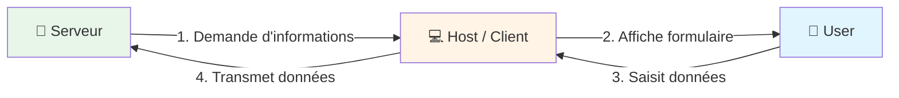

</div>

</div>


---
layout: default
section: "06"
sectionName: "Features client"
slideName: "Elicitation - Requête"
---

# Elicitation - Détails des payloads

Le serveur demande des informations à l'utilisateur

<div class="grid grid-cols-2 gap-4">

<div>

```json {all|5-15}
{
  "method": "elicitation/create",
  "params": {
    "mode": "form",
    "message": "Quel a été ton talk préféré ?",
    "requestedSchema": {
      "type": "object",
      "properties": {
        "name": {
          "type": "string"
        }
      },
      "required": [
        "name"
      ]
    }
  }
}
```

<p class="text-sm italic">Requête (serveur → client)</p>

</div>

<div>

```json {none|all}
{
  "result": {
    "action": "accept",
    "content": {
      "name": "Je te dirai ça vendredi."
    }
  }
}
```

<p class="text-sm italic">Réponse (client → serveur)</p>

</div>

</div>


---
layout: section-with-header
title: Roots
subtitle: Le client indique un dossier de travail au serveur
section: "06"
sectionName: "Features client"
slideName: "Roots"
---


---
layout: default
section: "06"
sectionName: "Features client"
slideName: "Roots - Flux"
---

# Roots - Flux d'exécution

<div style="position: relative; height: 400px; display: flex; align-items: center; justify-content: center;">

<div v-click.hide style="position: absolute; width: 100%; text-align: center;">

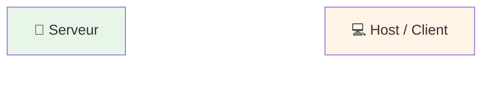

</div>

<div v-click="[1,2]" style="position: absolute; width: 100%; text-align: center;">

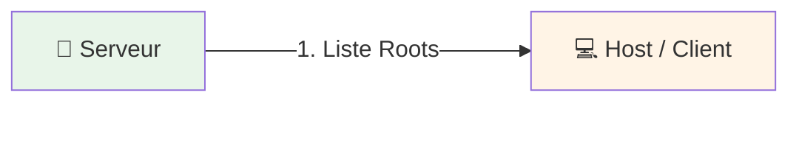

</div>

<div v-click=2 style="position: absolute; width: 100%; text-align: center;">

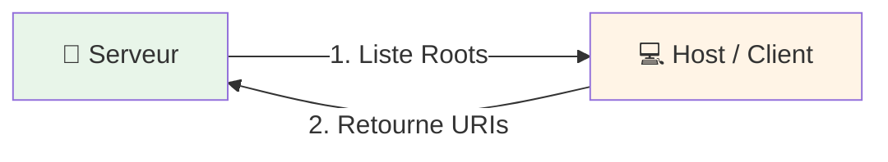

</div>

</div>


---
layout: default
section: "06"
sectionName: "Features client"
slideName: "Roots - Liste"
---

# Roots - Détails des payloads

Le client déclare ses dossiers de travail

<div class="grid grid-cols-2 gap-4">

<div>

```json
{
  "method": "roots/list"
}
```

<p class="text-sm italic">Requête (serveur → client)</p>

</div>

<div>

```json {none|all}
{
  "result": {
    "roots": [
      {
        "uri": "file:///home/user/project",
        "name": "My Project"
      }
    ]
  }
}
```

<p class="text-sm italic">Réponse (client → serveur)</p>

</div>

</div>

